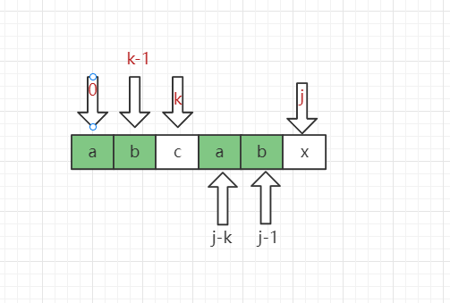

`KMP`

## 1. 前言

我们开发中，接触最多的基本类型应该就是字符串了，前端开发中我们常使用`indexOf`，`includes`等方法来判断字符串中是否含有某个子串，或找出子串在其中的开头下标。这种**子串的定位操作通常就叫做串的模式匹配**。

## 2.朴素的模式匹配算法

也就是最简单粗暴的模式匹配算法。

假设我们要从下面的主串`S="goodgoogle"`中，找到子串`T="google"`的位置。

（1）

第一步，双重循环比较对应位置的字符串是否相等。比较到`d!==g`时，进行第二步，子串👉右移一位，继续重复比较操作。

（2）

（3）如此循环后终于在主串第五个位置处，与子串全匹配。


思路分析完毕，我们实现下代码：

```js
function normalMatch(S, T) {
	let i = 0,
		j = 0;
	while (i < S.length && j < T.length) {
		if (S[i] == T[j]) {
			i++;
			j++;
		} else {
			i = i - j + 1;
			j = 0;
		}
	}
	if (j == T.length - 1) return i - j;
	else return -1;
}

let idx = normalMatch("goodgoogle", "google");
console.log(idx);
```

重点解析：


普通匹配模式算法的时间复杂度计算，假如主串S为`0-(48个0)-1`，子串T为`0-(9个0)-1`，在前41个0匹配开始的时候，每次都会把T串循环到最后一位才判断出不匹配。即T串在前40个位置都每次判断了10次。这时的进行了`(n-m)*m`次比较（n为主串长度，m为子串长度），在第41位0匹配时，循环完T串之后才发现全匹配成功，这里进行了m次比较，所以时间复杂度为`O((n-m+1)*m)`。

## 3.`KMP`

  思想：通过观察子串T的结构，**利用已经部分匹配这个有效信息，保持`i`指针不回溯，通过修改`j`指针，让模式串尽量地移动到有效的位置**，来简化回溯流程。

 `KMP`算法就是为了省略一些不必要的回溯，来提高查询的速度，降低时间复杂度。

### 3.1. 子串无重复字符

假如有主串S为`abcdefgab`，子串为`abcdex`。


按照上面的普通模式匹配算法进行匹配，步骤都应该按上图6个步骤进行。

​	仔细观察T串结构，看出T串中的首字母a与自身后面的字符都不相等，对于步骤①来说，前5位都匹配上了，那么就可以得出一个结论，字符a绝不可能和S串的第二位到第五位相等，S串第六位和T串第六位虽然不等，但是也不能推算出a!=f。所以就可以把步骤②~⑤给省略掉。

### 3.2 子串有重复字符

① 主串`ABACBCD`,子串T为`ABAD`


当前`C !== D`， 那么我们该如何在不移动`i`的情况下，正确移动`j`？可以观察出，移动到第二位，因为`D`前两有两个相同的A


假如主串S为`abcababca`，子串T为`abcabx`


​																						图6

由3.1的结论我们可以得知，a肯定不与主串S中的第二位和第三位相等，所以可省略②③，因为子串T的前缀ab和自身后面的第四位与第五位ab相等，T第四位和第五位又与主串的相应位置已经比较过了，所以这两次比较我们也可以省略，所以省略④⑤，到最后我们就可以简化得出①⑥的步骤。


​																			图7

### 3.3结论

​		T串`abcdex`中，没有任何重复的字符，所以`j`从`5`回到初始值`0`，子串中有重复字符的话，要看每个位置之前的字符串，前缀和后缀的重复情况来定`j`值是变化到多少。

至此我们可以大概看出一点端倪，当**匹配失败**时，j要移动的下一个位置k。存在着这样的性质：**最前面的k个字符和j之前的最后k个字符是一样的**。

如果用数学公式来表示是这样的

> P[0 ~ k-1] == P[j-k ~ j-1]

​	

所以子串`j`回溯到何处位置都是由T串**当前位置之前的串最大相同前缀后缀长度决定**。又因为可能子串的每个位置都可能发生不相等，所以我们可以求出一个next数组，它是关于子串每个位置不相等时，当前`j`回溯到什么位置的数组信息。由此我们可以推导出子串各个位置的next数组值。

### 3.4 举几个栗子

我们将第一位的next[0]值做特殊处理，将他等于`-1`。其余位置都依照之前的逻辑来计算

#### 3.4.1 T串`abcdex`：

T串的前缀可以为：`a`，`ab`，`abc`，`abcd`，`abcde`

后缀可以为：`x`，`ex`，`dex`，`cdex`，`bcdex`


#### 3.4.2 T串`ababaaaba`：


### 3.5 求next数组：

```js
function getNextArr(str) {
    let i = 0,
        k = -1,
        next = [];
    next[0] = -1;
    while (i < str.length - 1) {
        if (k == -1 || str[i] == str[k]) {
            i++;
            k++;
            next[i] = k;
        } else {
            // 不等就回溯
            k = next[k];
        }
    }
}
```

### 3.6 如何理解代码：m        

**记住next[k]的值（也就是k）表示，当P[j] != T[k]时，`k`指针的下一步移动位置。也是下标为k的字符前面的字符串最长相等前后缀的长度**。

`k`和`i`可以分别理解为前缀后缀指针，当两指针的值不相等时，将前缀指针回溯（回退）到最开始

### `KMP`代码：

```js
function kmpMatch(S, T) {
	let i = 0,
		j = 0;
    let next = getNextArr(T);
	while (i < S.length && j < T.length) {
		if (S[i] == T[j]) {
			i++;
			j++;
		} else {
			j = next[j];
		}
	}
	if (j == T.length - 1) return i - j;
	else return -1;
}
```

#### 3.6.1 时间复杂度

为了得到next数组，循环了整个T串，记为O(m)；在匹配的过程中，因为`i`值始终没变化，所以我们只循环了整个S串，复杂度记为O(n)，所以整个算法的时间复杂度为O(m+n)，比起之前的普通匹配模式（复杂度为O((n-m+1)*m)）要好很多。

## 4. `KMP`改进


上述子串的next数组值为`[-1, 0, 0, 1]`，所以下一部状态是


这一步，又发生了B和C比较，前一步已经知道两者不相等了，所以这步完全可以跳过，出现此处的前提条件明显是因为`P[j] == P[next[j]]`导致的，所以我们可以再加上一个判断

```js
function getNextArr(str) {
    let j = 0,
        k = -1,
        next = [];
    next[0] = -1;
    while (j < str.length - 1) {
        if (k == -1 || str[j] == str[k]) {
            j++;
            k++;
            if (str[j] == str[k]) { // 当两个字符相等时要跳过
             	next[j] = next[k];
                
             } else {
                 next[j] = k;
             }
        } else {
            // 不等就回溯
            k = next[k];
        }
    }
}
```

