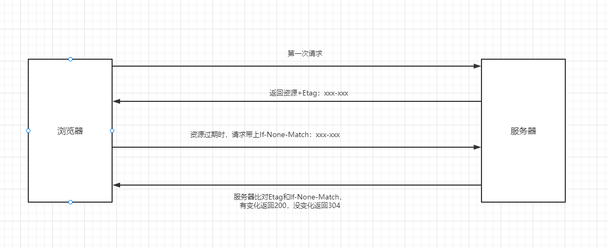
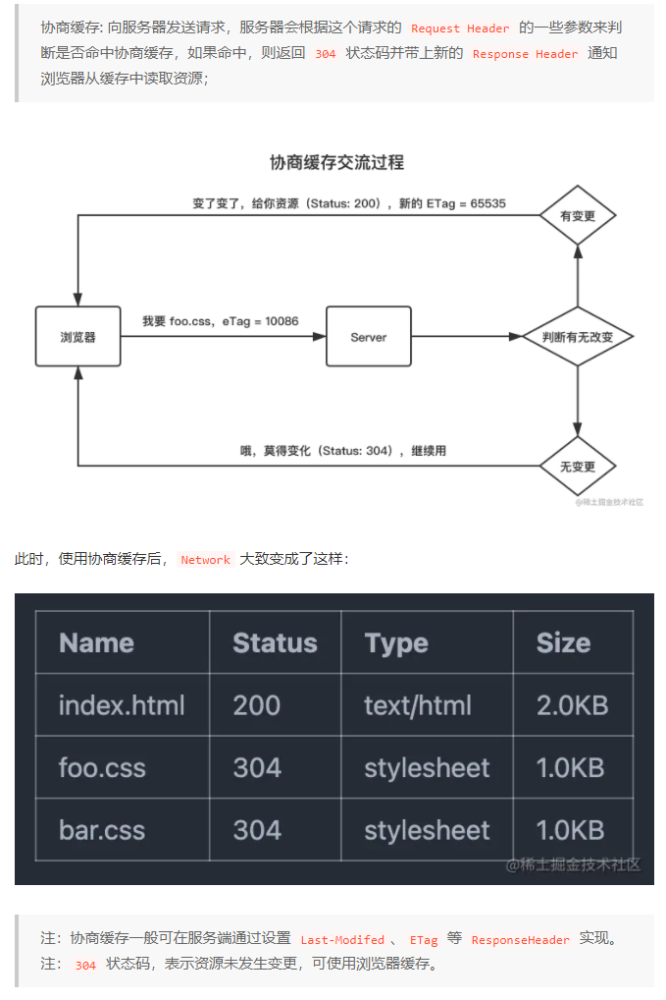
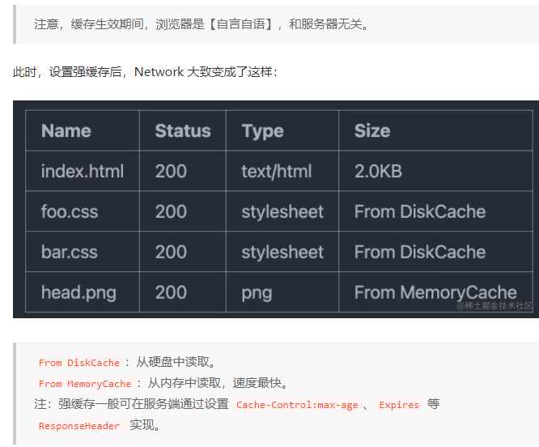
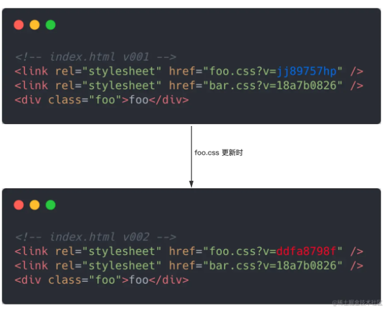
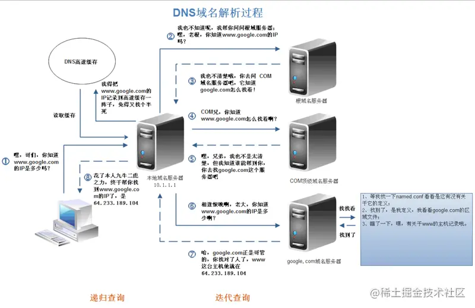
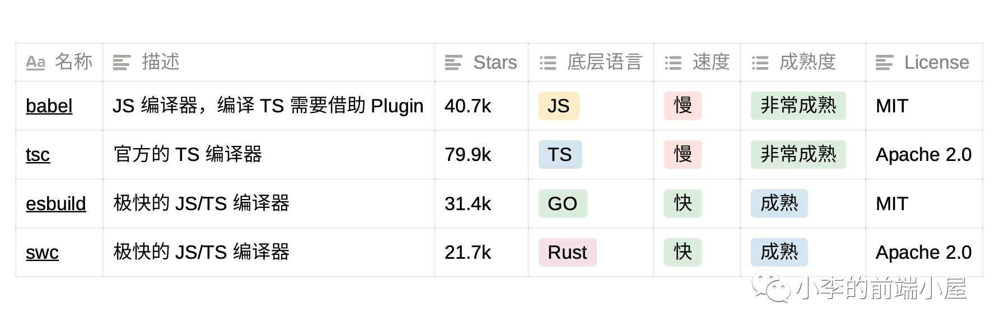
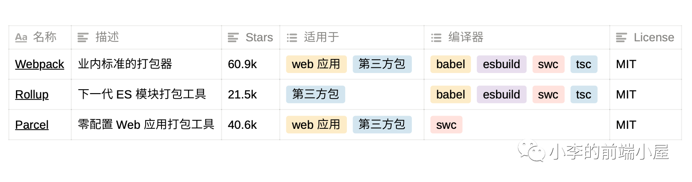
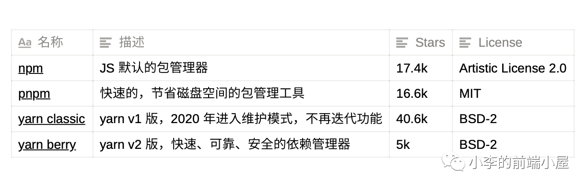
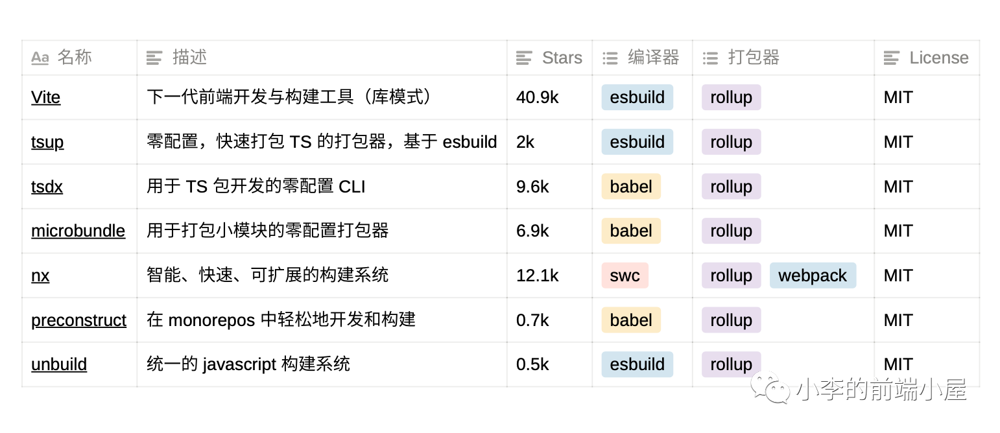
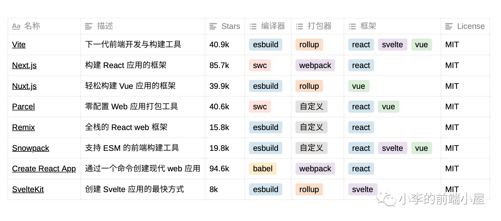

2021-10-20学习笔记：

### [前端部署一些知识](https://juejin.cn/post/7017710911443959839#heading-0)：

静态资源组织

前端资源由`html`，`css`,`js`三个组成，用户每次访问都会请求 `foo.css`, `bar.css` 等静态文件，即使该文件并无变更。对带宽甚是浪费，对页面首屏性能等也有影响。于是在网络带宽紧张的互联网早期，计算机先贤们在 `HTTP` 协议上制定了多种缓存策略。

### 缓存知识

> 200 form memory cache : 不访问服务器，一般已经加载过该资源且缓存在了内存当中，直接从内存中读取缓存。浏览器关闭后，数据将不存在（资源被释放掉了），再次打开相同的页面时，不会出现from memory cache。

> 200 from disk cache： 不访问服务器，已经在之前的某个时间加载过该资源，直接从硬盘中读取缓存，关闭浏览器后，数据依然存在，此资源不会随着该页面的关闭而释放掉下次打开仍然会是from disk cache。

> 优先访问memory cache,其次是disk cache，最后是请求网络资源

### 协商缓存

header参数：

`Last-Modified/If-Modified-Since`和`Etag/If-None-Match`是分别成对出现的，呈一一对应关系。

##### 1. `Etag`/`If-None-Match`：

`Etag`：

> `Etag`是属于HTTP 1.1属性，它是由服务器（Apache或者其他工具）生成返回给前端，用来帮助服务器控制Web端的缓存验证。 Apache中，`ETag`的值，默认是对文件的索引节（`INode`），大小（Size）和最后修改时间（`MTime`）进行Hash后得到的。

If-None-Match:

> 当资源过期时，浏览器发现响应头里有`Etag`,则再次像服务器请求时带上请求头if-none-match(值是`Etag`的值)。服务器收到请求进行比对，决定返回200或304

##### 2. Last-Modifed/If-Modified-Since：

Last-Modified：

> 浏览器向服务器发送资源最后的修改时间

If-Modified-Since：

> 当资源过期时（浏览器判断Cache-Control标识的max-age过期），发现响应头具有Last-Modified声明，则再次向服务器请求时带上头if-modified-since，表示请求时间。服务器收到请求后发现有if-modified-since则与被请求资源的最后修改时间进行对比（Last-Modified）,若最后修改时间较新（大），说明资源又被改过，则返回最新资源，HTTP 200 OK;若最后修改时间较旧（小），说明资源无新修改，响应HTTP 304 走缓存。

> - Last-Modified/If-Modified-Since的时间精度是秒，而Etag可以更精确。
> - Etag优先级是高于Last-Modified的，所以服务器会优先验证Etag
> - Last-Modified/If-Modified-Since是http1.0的头字段





### 强缓存

浏览器和服务器协商好资源的过期时间，没过期的时候浏览器都直接从缓存在取资源。

> 强缓存：浏览器不会向服务器发送任何请求，直接从本地缓存中读取文件并返回`Status Code: 200 OK`。

header参数：

Expires：过期时间，如果设置了时间，则浏览器会在设置的时间内直接读取缓存，不再请求

Cache-Control：当值设为max-age=300时，则代表在这个请求正确返回时间（浏览器也会记录下来）的5分钟内再次加载资源，就会命中强缓存。

```js
（1） max-age：用来设置资源（representations）可以被缓存多长时间，单位为秒；
（2） s-maxage：和max-age是一样的，不过它只针对代理服务器缓存而言；
（3）public：指示响应可被任何缓存区缓存；
（4）private：只能针对个人用户，而不能被代理服务器缓存；
（5）no-cache：强制客户端直接向服务器发送请求,也就是说每次请求都必须向服务器发送。服务器接收到     请求，然后判断资源是否变更，是则返回新内容，否则返回304，未变更。这个很容易让人产生误解，使人误     以为是响应不被缓存。实际上Cache-Control:     no-cache是会被缓存的，只不过每次在向客户端（浏览器）提供响应数据时，缓存都要向服务器评估缓存响应的有效性。
（6）no-store：禁止一切缓存（这个才是响应不被缓存的意思）。
```

> cache-control是http1.1的头字段，expires是http1.0的头字段,如果expires和cache-control同时存在，cache-control会覆盖expires，建议两个都写。



### 缓存更新问题

q：如果静态资源走强缓存，但是在有效期间我们主动更新了`css`，怎么办？

采用[消息摘要算法](https://www.baike.com/wikiid/1412805162344902915?search_id=3k1jee3i202000&prd=search_sug&view_id=1532cauomgn400) ，对文件求摘要信息，摘要信息与文件内容一一对应，就有了一种可以精确到单个文件粒度的缓存控制依据。现在，我们把 `URL` 改成带文件摘要信息的：



### 覆盖式发布引发的问题

假设我们网站有10个资源，一个网速相对慢的用户打开了页面（旧版HTML、旧版DOM）正加载到第5个资源，然后我们发布上线了，将后5个资源更新了（新版逻辑）。这时会发生什么呢？可能就炸锅了哦！

1. **先部署静态资源，部署期间访问时，会出现V1版本HTML访问到V2版本新静态资源，并按V1-hash缓存起来。**
2. **先部署HTML，部署期间访问时，会出现V2版本HTML访问到V1版本旧静态资源，并按V2-hash缓存起来。**

解决问题方案也极其简单，使用**非覆盖式发布**，一种简单的改造方式是将文件摘要（`hash`）放置到`URL` 中，即将 `query-hash` 改为 `name-hash`。

> 此时，服务器上会存在多份 `foo.[$hash].css` 文件

### 与 `CDN` 结合


------

2021-10-21

## vue3.2

### <script setup>单文件组件

这意味着与普通的 `<script>` 只在组件被首次引入的时候执行一次不同，`<script setup>` 中的代码会在**每次组件实例被创建的时候执行**。

```vue
<script setup>
	console.log('hello script setup')
</script>
```

#### 特性：

1.  顶层的数据绑定和import的内容都被暴露给模板
2. import的vue组件可直接再模板中使用
3. 动态组件

```vue
<script setup>
import Foo from './Foo.vue'
import Bar from './Bar.vue'
</script>

<template>
  <component :is="Foo" />
  <component :is="someCondition ? Foo : Bar" />
</template>
```

4. 命名空间组件：This is useful when you import multiple components from a single file:

```vue
// 一次性引入一个文件夹中的所有组件，通过obj带点的方式来引入各个组件
<script setup>
import * as Form from './form-components'
</script>

<template>
  <Form.Input>
    <Form.Label>label</Form.Label>
  </Form.Input>
</template>
```

5. ### `defineProps` 和 `defineEmits`

   用来定义prop和emit，无需导入

6. `defineExpose`暴露出变量或方法（当父组件通过模板 ref 的方式获取到当前组件的实例，就可获得暴露出去的属性）

7. ### 可以和普通的<script>一起使用

   - 无法在 `<script setup>` 声明的选项，例如 `inheritAttrs` 或通过插件启用的自定义的选项。
   - 声明命名导出。
   - 运行副作用或者创建只需要执行一次的对象。

8. 顶层await

```vue
// 直接使用await 让它编译为async setup()
<script setup>
const post = await fetch(`/api/post/1`).then(r => r.json())
</script>
```

***

# 2021-10-22

制作`gif`工具 ：windows 使用`ScreenToGif` `MacOS` 使用 `Kap`

### filter:drop-shadow();

相比于`box-shadow`是作用于整个盒子边界的，而 `drop-shadow()` 过滤器则是创建一个符合图像本身形状(alpha 通道)的阴影。

## [svg线条动画入门](https://www.cnblogs.com/coco1s/p/6225973.html)：

> SVG 线条动画，在一些特定的场合下可以解决使用 CSS 无法完成的动画。

`eg`：

```html
<svg version="1.1" xmlns="http://www.w3.org/2000/svg" xmlns:xlink="http://www.w3.org/1999/xlink" xml:space="preserve" class="circle-load-rect-svg" width="300" height="200" viewbox="0 0 600 400">
    <polyline points="5 5, 575 5, 575 200, 5 200" class="g-rect-path"/>
    <polyline points="5 5, 575 5, 575 200, 5 200" class="g-rect-fill"/>
</svg>
```


#### `svg`标签：

- `version`： 表示 `<svg>` 的版本，目前只有 1.0，1.1 两种
- `xmlns`：`http://www.w3.org/2000/svg` 固定值
- `xmlns:xlink`：`http://www.w3.org/1999/xlink` 固定值
- `xml:space`：`preserve` 固定值，上述三个值固定，表示命名空间，当数据单独存在`svg`文件内时，这3个值不能省略
- `class`：就是我们熟悉的 class
- `width` | `height`： 定义 `svg` 画布的大小
- `viewbox`： 定义了画布上可以显示的区域，当 viewBox 的大小和 svg 不同时，viewBox 在屏幕上的显示会缩放至 svg 同等大小（暂时可以不用理解）

#### svg基本形状

`polyline`（折线）：是SVG的一个基本形状，用来创建一系列直线连接多个点。

```html
<polyline points="60 110, 65 120, 70 115, 75 130, 80 125, 85 140, 90 135, 95 150, 100 145"/>
```

`polygon`（多边形）：和折线很像，它们都是由连接一组点集的直线构成。不同的是，`polygon`的路径在最后一个点处自动回到第一个点

比较常用的是`line`（线）,`path`（路径），`rect`（矩形），`circle`（圆） 等

`path`：太强大了，复杂的图形不好写，用[svg生成工具](https://yqnn.github.io/svg-path-editor/)吧。

#### 配合svg的一些`css`参数：

- `fill`：类比 css 中的 `background-color`，给 `svg` 图形填充颜色；
- `stroke-width`：类比 css 中的 `border-width`，给 `svg` 图形设定边框宽度；
- `stroke`：类比 css 中的 `border-color`，给 `svg` 图形设定边框颜色；
- `stroke-linejoin` | `stroke-linecap`：上文稍微提到过，[设定线段连接处的样式](https://developer.mozilla.org/zh-CN/docs/Web/SVG/Attribute/stroke-linejoin)；
- `stroke-dasharray`：值是一组数组，没数量上限，每个数字交替表示实线与空白间隔的宽度，若是奇数个，则会重复一次补成偶数，eg：5，3，2等于 5，3，2，5，3，2；
- `stroke-dashoffset`：则是虚线的偏移量

## Docker

docker解决了运行环境不一致所带来的问题.

理解：镜像就是说的集装箱,仓库就是超级码头,容器就是我们运行程序的地方.docker运行程序的过程就是去仓库把镜像拉到本地,然后用一条命令把镜像运行起来变成容器.

#### 镜像

镜像的英文名叫image。前面我们讲到了集装箱,鲸鱼拖着的所有集装箱就是一个镜像。从本质上来说镜像就是一系列文件,可以包括我们应用程序的文件,也可以包括我们应用的运行环境的文件。


#### 容器

图1的最上层，只有它是可写的，其他层都是只读。

#### 仓库

我们的镜像是要在其它机器上运行,如何进行传输呢?

docker仓库,我们要先把我们的镜像传到docker仓库中,再由目的地把docker仓库拉过去,这就完成了这样的一次传输过程.

#### Dcokerfile

只是一个包含指令集的脚本。

```dockerfile
# syntax=docker/dockerfile:1
FROM node:12-alpine  // 从node:12-alpine image开始
RUN apk add --no-cache python g++ make
WORKDIR /app
COPY . .
RUN yarn install --production
CMD ["node", "src/index.js"]
```

### 基本命令

1. 拉取镜像

```powershell
docker pull [options] NAME[:TAG]
// name:镜像名 TAG: 版本号（可选） option 参数  
```

2. 

```powershell
docker images [options] [REPOSITORY[:TAG]]
```

3. 

```powershell
docker build -t getting-started .
```

-t：命名我们的image名，最后的`.`表示将在当前目录寻找`Dockerfile`

4. 

```
docker run -dp 3000:3000 getting-started
```


------

2021-11-5  微前端

- 子系统间的开发、发布从空间上完成隔离
- 子系统可以使用不同的技术体系
- 子系统间可以完成基础库的代码复用
- 子系统间可以快速完成通信
- 子系统间需求迭代互不阻塞
- 子应用可以增量升级
- 子系统可以走向同一个灰度版本控制
- 提供集中子系统权限管控
- 用户使用体验整个系统是一个单一的产品，而不是彼此的孤岛
- 项目的监控可以细化到到子系统

------

# 2021-11-9 js第四版

## `BOM`

1. let、const声明的变量不会挂载在window上

2. 窗口大小

   - `innerHeight`和`innerWidth`、`clientWidth` 和 `clientHeight` 返回屏幕上页面可视区域的大小。
   - `outerWidth` 和 `outerHeight`返回浏览器窗口自身的大小

3. 视口位置

   - `scroll()`、`scrollTo()`和 `scrollBy()`

   - ```js
     window.scrollTo({ 
      left: 100, 
      top: 100, 
      behavior: 'smooth'  // 平滑滚动 'auto'正常滚动
     }); 
     ```

4. 定时器返回的是任务数值ID

5. location对象：它既是 window 的属性，也是 document 的属性

   1. `URLSearchParams`对象：这个实例上暴露了 get()、 set()和 delete()等方法，获取字符串?后的参数

   2. 修改地址：

      `location.assign("http://www.wrox.com")`

      `window.location = "http://www.wrox.com"; `

      ` location.href = "http://www.wrox.com"; `

      replace、reload

6. `navigator`对象：的属性通常用于确定浏览器的类型。

   1. `navigator.platform`属性是一个字符串，通常表示浏览器所在的操作系统
   2. `navigator.vendor` 属性是一个字符串，通常包含浏览器开发商信息。
   3. `navigator.onLine` 联网情况
   4. `navigator.connection` 网络链接情况
   5. `navigator.getBattery()` 设备电池情况

2. `screen`对象：保存的纯粹是客户端能力信息

   其中`orientation` 返回屏幕的朝向，包含属性type（方向）和angle（角度）

3. `history`对象：用户的导航历史记录

   - go(Int) 前进或后退多少步
   - back()
   - forward() 

## `DOM`

### Node类型(12种)

节点关系

1. `appendChild()`: 在`childNode`列表末尾添加节点, 若传入的是已经存在的节点, 那么这个节点的位置会被改变

2. `insertBefore()`接收两个参数：要插入的节点和参照节点。如果参照节点是 null，则 `insertBefore()`与 `appendChild()`效果相 同
3. `replaceChild()`方法接收两个参数：要插入的节点和要替换的节点。要替换的节点会被返回并从文档 树中完全移除
4. `removeChild()` 移除节点
5. `cloneNode(Boolean)`  克隆节点, 传入true表示深克隆文档树, false为复制调用该方法的节点.

#### 1. document类型 `NoeType` : 9

1. 因为跨源通信存在安全隐患，所以不同子域的页面间无法通过 JavaScript 通信。此时，在每个页面上把 `document.domain`设置为相同的值，这些页面就可以访问对方的 JavaScript 对象了。

2. 获取元素引用的方法返回的一个`HTMLCollection`对象, 此对象和`NodeList`相似. `HTMLCollection`对象还有个方法`namedItem()`, 可通过标签name属性取得特定的一项.

```html


<script>
    let images = document.getElementsByTagName("img"); 
    let myImage = images.namedItem("myImage");
   // 或者
    let myImage = images["myImage"];
</script>
```

3. 获取所有文档元素:  可以给 `getElementsByTagName('*')`

4. 文档写入

   write()、 `writeln()`、open()和 close()

   ​		write()和 `writeln()`方法经常用于动态包含外部资源，如 JavaScript 文件。在包含 JavaScript 文件时，记住不能像下面的例子中这样直接包含字符串`</script>`，因为这个字符串会被解释为脚本块 的结尾，导致后面的代码不能执行. 需要将/ 转化, 即 `<\/script>`

#### 2. Element类型 `NodeType` : 1

1. 取得属性、设置、移除

   * `getAttribute()`、`setAttribute()`和 `removeAttribute()`

     要传"class"而非`className`, 传入的class不区分大小写. 

     `eg`:  

     ```js
     let div = document.getElementById("myDiv"); 
     alert(div.getAttribute("id")); // "myDiv" 获得id
     alert(div.getAttribute("class")); // "bd" 获得class
     ```

#### 3. `MutationObserver` 接口 

​	 可以在 DOM 被修改时异步执行回调

##### 3.1 基本用法：

1. observe()方法

   接收两个必需的参数：要观察其变化的 DOM 节点，以及 一个 `MutationObserverInit` 对象

```js
// 观察<body>的变化
// 第二个参数是观察变化的 MutationObserver的实例
let observer = new MutationObserver((MutationRecord,mutationObserver) => console.log('<body> attributes changed')); 
observer.observe(document.body, { attributes: true });

// 执行以上代码后，<body>元素上任何属性发生变化都会被这个 MutationObserver 实例发现，然
// 后就会异步执行注册的回调函数。<body>元素后代的修改或其他非属性修改都不会触发回调进入任务
// 队列。可以通过以下代码来验证

document.body.className = 'foo'; 
console.log('Changed body class'); 

// Changed body class 
// <body> attributes changed 
```

2. `MutationRecord` 实例的数组

   * `MutationRecord `实例包含的信息包括发生了什么变化，以及 DOM 的哪一部分受到了影响。因为回调执行之前可能同时发生多个满足观察条件 的事件，所以每次执行回调都会传入一个包含按顺序入队的 `MutationRecord `实例的数组。

3. `discount()`方法

   * 默认情况下，只要被观察的元素不被垃圾回收，`MutationObserver` 的回调就会响应 DOM 变化事 件，从而被执行。要提前终止执行回调，可以调用 disconnect()方法。下面的例子演示了同步调用 disconnect()之后，不仅会停止此后变化事件的回调，也会抛弃已经加入任务队列要异步执行的回调

4. 复用 `MutationObserver`

   观察多个不同的目标节点

##### 3.2`MutationObserverInit `与观察范围

`MutationObserverInit `是调用observe()时的第二个参数对象，他的属性有：


### `querySelectorAll()`、`querySelector()`

​		都传入`css`选择符，且都可以在Element类型上使用，在 Element 上使用` querySelector()`方法	时，则只会从当前元素的后代中查询。

​		返回的是一个 `NodeList` 的静态实例。不是实时的。

###  matches()

​		接收一个 `CSS` 选择符参数，如果元素 匹配则该选择符返回 true，否则返回 false。

###  ` getElementsByClassName()`

​		可在Element类型上使用

### `classList()`:

要操作类名，可以实现添加、删除和替换

* add(val)
* contains(val)
* remove(val)
* toggle(val)

### `HTMLDocument `扩展

#### 1. `document.readyState` 属性：判断文档是否加载完毕

属性值

* loading
* complete

#### 2. `compatMode `属性：检测页面渲染模式

#### 3.  自定义数据属性

定义了自定义数据属性后，可以通过元素的 dataset 属性来访问

```html
<div id="myDiv" data-appId="12345" data-myname="Nicholas"></div>

<script>
    let div = document.getElementById("myDiv"); 
    // 取得自定义数据属性的值
    let appId = div.dataset.appId; 
    let myName = div.dataset.myname; 
</script>
```

### 插入标记

* `innerHTML`

* `outerHTML`

* `insertAdjacentHTML()`与 `insertAdjacentText()`

  * 都接收两个参数：要插入标记的位置和要插入的 HTML 或文本。第一个参数 必须是下列值中的一个： 

    ​	 `beforebegin`，插入当前元素前面，作为前一个同胞节点； 

    ​	 `afterbegin`，插入当前元素内部，作为新的子节点或放在第一个子节点前面； 

    ​	 `beforeend`，插入当前元素内部，作为新的子节点或放在最后一个子节点后面； 

    ​	 `afterend`，插入当前元素后面，作为下一个同胞节点。

### ！！！注意！！！：

​		如果被移除的 子树元素中之前有关联的事件处理程序或其他 JavaScript 对象（作为元素的属性），那它们之间的绑定关 系会滞留在内存中。如果这种替换操作频繁发生，页面的内存占用就会持续攀升。在使用 `innerHTML`、 `outerHTML`和 `insertAdjacentHTML()`之前，最好手动删除要被替换的元素上关联的事件处理程序和 JavaScript 对象

### 总结

1. `NodeList`是实时更新的，意味着每次访问它都会执行一次查找。

------

# 2021-11-10

## 前端监控

前端监控可以分为三类：数据监控、性能监控和异常监控。

#### 1. 数据监控：

* `PV/UV`：页面浏览量或点击量。UV:指访问某个站点或点击某条新闻的不同`IP`地址的人数
* 用户在每一个页面的停留时间
* 用户通过什么入口来访问该网页
* 用户在相应的页面中触发的行为

#### 2. 性能监控

* 不同用户，不同机型和不同系统下的首屏加载时间
* 白屏时间
* http等请求的响应时间
* 静态资源整体下载时间
* 页面渲染时间
* 页面交互动画完成时间

#### 3. 异常监控

* `Javascript`的异常监控
* 样式丢失的异常监控

## 数据埋点

数据埋点一般可以分为两类，**前端埋点**和**后端埋点**。统计产品中用户行为和使用情况。

### 前端埋点

分为：代码埋点，可视化埋点和无埋点。


**【定义】：**主要在客户端进行埋点，收集前端数据，例如用户行为，界面变化等。

**【应用】：**适合于业务处于运营初级阶段，产品功能相对简单；需求分析于后端没有交互的前端行为。

#### 1.1 . 代码埋点（手动埋点）

调用埋点 SDK 的函数，在需要埋点的业务逻辑功能位置调用接口，一般有捕捉滚动、点击事件来上报埋点数据。

​	优点：设置自定义属性、自定义事件。

​	缺点：量大难维护，效率低。

​	`eg`：[百度统计](https://link.zhihu.com/?target=https%3A//tongji.baidu.com/web/welcome/login)

##### 1.1.1  代码实例

​		收集用户信息：将收集好的数据通过 Image 对象实例的 src 属性指向后端脚本并携带参数，就可以将我们收集的数据传给后端，之所以用 Image 对象而不是 ajax，是为了避免跨域的问题。

```js
function sendToNginx(info) {
  let str = "";
  for (let i in info) { // Object.keys(obj) ie 9 以上才兼容, for..in.. ie 6 以上兼容
    if (str === "") {
      str = i + "=" + info[i];
    } else {
      str += "&" + i + "=" + info[i];
    }
  }
  const url = 'https://tpm.tuyacn.com/tpm.gif' + '?' + str;
  new Image().src = url
}
```

一般获取的信息：

* 用户浏览器语言、尺寸、版本

* 触发事件类型

* 用户信息：唯一id

* 页面滚动距离

* 通过`Performance` 我们便能拿到`DNS` 解析时间、TCP 建立连接时间、首页白屏时间、DOM 渲染完成时间、页面 load 时间等

  ```js
  //拿到Performance并且初始化一些参数
  let timing = performance.timing,
      start = timing.navigationStart,
      dnsTime = 0,
      tcpTime = 0,
      firstPaintTime = 0,
      domRenderTime = 0,
      loadTime = 0;
  //根据提供的api和属性，拿到对应的时间
  dnsTime = timing.domainLookupEnd - timing.domainLookupStart;
  tcpTime = timing.connectEnd - timing.connectStart;
  firstPaintTime = timing.responseStart - start;
  domRenderTime = timing.domContentLoadedEventEnd - start;
  loadTime = timing.loadEventEnd - start;
  
  console.log('DNS解析时间:', dnsTime, 
              '\nTCP建立时间:', tcpTime, 
              '\n首屏时间:', firstPaintTime,
              '\ndom渲染完成时间:', domRenderTime, 
              '\n页面onload时间:', loadTime);
  ```

  

#### 1.2 可视化埋点

​		将业务代码和埋点代码分离，提供一个可视化交互的页面，输入为业务代码，通过这个可视化系统，可以在业务代码中自定义的增加埋点事件等等，最后输出的代码耦合了业务代码和埋点代码。

服务商[Mixpanel](https://mixpanel.com/zh-hant/)

#### 2. 埋点按照获取数据的方式一般可以分为：

1. **曝光事件：**主要记录页面被用户浏览次数。
2. **点击事件：**点页面某个对象触发的事件
3. **页面停留时间**：主要记录用户在某页面停留时间

#### 3. 上报周期和上报数据类型：

​		如果埋点的事件不是很多，上报可以时时进行，比如监控用户的交互事件，可以在用户触发事件后，立刻上报用户所触发的事件类型。如果埋点的事件较多，或者说网页内部交互频繁，可以通过本地存储的方式先缓存上报信息，然后定期上报。


#### 举例

1. 我们以上报首屏加载事件为例，DOM提供了document的`DOMContentLoaded`事件来监听`dom`挂载，提供了window的load事件来监听页面所有资源加载渲染完毕。

2. [政采云团队]: https://juejin.cn/post/6844904061934780424#comment

   采用了 DOM 节点挂载特殊属性后自动发送和手动自定义发送两种方式结合，以满足不同场景的需要。

```html
//自动发送埋点方式，举例：
<button data-utm-click="${did}" data-utm-data="${业务数据}">
//手动发送埋点方式，举例：
const utmCnt = g_UTM.batchSend('触发类型（click/browse）等',[{
    utmCD:['区块信息','位置信息'],
    bdata:{key:'其他业务数据'}
  },{
    utmCD:['001','008'],
    bdata:{key:'value'}
  }
]);
```

## [前端优秀实践不完全指南](https://juejin.cn/post/6932647134944886797#heading-13 )

​	滚动平滑：使用 `scroll-behavior: smooth` 让滚动丝滑

​	使用 `scroll-snap-type` 优化滚动效果

------

# 2021-11-12 js第四版

## 1. 样式

js中获取DOM元素的style只会包含行内样式。

> 包含通过 HTML **style 属性**为元素设置的所有样式信 息，但不包含通过层叠机制从文档样式和外部样式中继承来的样式

#### 计算样式(只读)

​	`getComputedStyle()`：接收两个参数：要取得计算样式的元素和伪元素字符串（如":after"）。如果不需要查 询伪元素，则第二个参数可以传 null。

```js
document.defaultView.getComputedStyle(document.getElementsByClassName('box')[0])
```

#### 操作样式表(`CSSStyleSheet`)

​	包括使用`<link>`元素和通过`<style>`元素定义的样式表。`CSSStyleSheet`的属性里除了 disabled，其他属性都是只读的。

​		`document.styleSheets`表示文档中可用的样式表集合。这个集合的 length 属性保存着文档中 样式表的数量，而每个样式表都可以使用中括号或 item()方法获取

#####  `CSS` 规则(`CSSRule`)


#####  创建规则

```js
let sheet = document.styleSheets[0];
sheet.insertRule("body { background-color: silver }", 0); // 使用 DOM 方法
```

##### 删除规则

```js
sheet.deleteRule(0); // 使用 DOM 方法
```

## 2. 元素尺寸

### 偏移尺寸（只读）

```js
offsetHeight = border + padding + content
```


### 客户端尺寸（只读）

```js
clientWidth = content + padding;
```

### 滚动尺寸


`scrollWidth`和 `scrollHeight`可以用来确定**给定元素内容的实际尺寸**。

`scrollLeft` 和 `scrollTop` 属性可以用于确定当前元素滚动的位置，或者用于设置它们的滚动位 置。元素在未滚动时，这两个属性都等于 0。如果元素在垂直方向上滚动，则 `scrollTop` 会大于 0， 表示元素顶部不可见区域的高度。

## 3. 遍历

### NodeIterator

​		通过 `document.createNodeIterator()`方法创建其实例。遍历规则是**深度优先遍历**，接受以下4个参数：

* `root`，作为遍历根节点的节点。 
* `whatToShow`，数值代码，表示应该访问哪些节点。 
* `filter`，`NodeFilter` 对象或函数，表示是否接收或跳过特定节点。 
* `entityReferenceExpansion`，布尔值，表示是否扩展实体引用。这个参数在 HTML 文档中没 有效果，因为实体引用永远不扩展。


​       `createNodeIterator()`方法的 filter 参数可以用来指定自定义 `NodeFilter`对象，或者一个 作为节点过滤器的函数。`NodeFilter`对象只有一个方法 `acceptNode()`，如果给定节点应该访问就返 回 `NodeFilter.FILTER_ACCEPT`，否则返回 `NodeFilter.FILTER_SKIP`。因为 `NodeFilter` 是一个 抽象类型，所以不可能创建它的实例。只要创建一个包含 `acceptNode()`的对象，然后把它传给 `createNodeIterator()`就可以了。

```js
let filter = { 
 acceptNode(node) { 
 return node.tagName.toLowerCase() == "p" ? 
     NodeFilter.FILTER_ACCEPT : 
     NodeFilter.FILTER_SKIP; 
 } 
}; 

// filter也可以是个函数
// 不做过滤处理就将filter设为null
/*
    let filter = function(node) { 
         return node.tagName.toLowerCase() == "p" ? 
         NodeFilter.FILTER_ACCEPT : 
         NodeFilter.FILTER_SKIP; 
    }; 
*/

let iterator = document.createNodeIterator(root, NodeFilter.SHOW_ELEMENT, filter,false); 
```

​	   `NodeIterator `的两个主要方法是 **`nextNode()`和 `previousNode()`**。`nextNode()`方法在 DOM 子树中以深度优先方式进前一步，而 `previousNode()`则是在遍历中后退一步。创建 `NodeIterator` 对象的时候，会有一个内部指针指向根节点，因此第一次调用 `nextNode()`返回的是根节点。当遍历到 达 DOM 树最后一个节点时，`nextNode()`返回 null。

### TreeWalker

​	`document.createTreeWalker()`方法来创建，这个方法接收与 `document.createNodeIterator()`同样的参数.

遍历方法：

* `nextNode()`、`previousNode()`
* `parentNode()` ：遍历到当前节点的父节点
* `firstChild()`：遍历到当前节点的第一个子节点
* `lastChild()`： 
* `nextSibling()`
* `previousSibling()`

`TreeWalker` 类型也有一个名为 `currentNode` 的属性，表示遍历过程中上一次返回的节点（无论 使用的是哪个遍历方法）。可以通过修改这个属性来影响接下来遍历的起点，

## 4. 范围

DOM范围`document.createRange()`，拥有的方法和属性：

* `startContainer`：范围起点
* `startOffset`：偏移量
* `endContainer`：范围终点
* `endOffset`：
* `commonAncestorContainer`：

### 简单选择

`selectNode()（选择整个节点）或 selectNodeContents()（选择节点的后代）`：接受一个节点作为参数

------

# 2021-11-19 阅读《高性能js》

## 1. 函数作用域链

​	函数的内部属性[[scope]]包含了一个函数被创建的作用域中的对象集合。这个集合被称为作用域链。

​	函数在创建的时候，它的作用域链被插入了一个对象变量，这个全局变量代表着所有在全局范围内定义的变量。

​	执行函数的时候会创建一个称为*执行环境*的内部对象，一个执行环境定义了一个函数执行时的环境。每次执行都有不同的执行环境，执行完毕，执行环境被销毁。每个执行环境都有自己的作用域链，当执行环境被创建时，它的作用域链初始化为当前函数的[[scope]]属性中的对象。 这个对象的值按照出现在函数中的顺序被复制到执行环境的作用域链中，复制完之后，一个叫活动对象的新对象就为执行环境创建好了。活动对象是函数运行时的变量对象，包含了所有局部变量、命名参数以及this。此对象会被推入作用域链中的最前端。

​	因为作用域链中的原因，一个标识符所在的位置越深，它的读写速度就越慢。所以局部变量的读写速度是最快的，全局变量是最慢的。

## 2. 改变作用域链

1. with：

   ```js
   with(document){
   	// 此时document对象的属性被推入作用域链的最前端，所以访问document对象属性最快，但是这里面的局部变量访问反而多一层
   }
   ```

2. try...catch

   ```js
   // 发生错误时，执行过程会跳转到catch子句中，把异常的对象推入一个变量对象且置于作用域链首位
   ```

## 3. 闭包、作用域和内存

此处闭包的解析：闭包代码被执行时，会创建一个执行环境，会生成一个专属闭包的活动对象，活动对象包含访问的那个外部变量a，且此活动对象被推入作用域链的头部。函数结束执行之后，由于要保证能访问到外部变量a，所以此变量对象不会被销毁。

## 对象

对象有两个成员类型：实例成员和原型成员，实例成员存在于实例对象中，原型成员是从对象原型继承而来的。

------

# 2021-11-29

今日工作遇到的一个issue

`vue`中使用`provide/inject`注入依赖响应式的问题，依赖想传入接口获取最新的值(数组)。所以刻意包成了对象。

> `provide` 和 `inject` 绑定并不是可响应的。这是刻意为之的。然而，如果你传入了一个可监听的对象，那么其对象的 property 还是可响应的。

此处还有个疑惑：不知为什么几个一样的变量，直接传入数组类型都可以得到最新的数据，6个中有两个逻辑完全一样 ，但是就是不行，我也加了`async/await`（没起作用），maybe接口返回的时间超过了哪个生命周期？

# 2022-3-22

摘要：服务号可以主动推送自定义消息给用户，只需要用户的`openid`。

####  `uniapp`开发微信`h5`，获取用户`openid`???

1. 引导用户跳转固定`url`，需要`appid`、用`encodeURIComponent`编码后的回跳地址，以此获取code
2. 拿到code后，传给后端，后端调用获取`openid`的接口。(因为`appsecret`需要保持私密，不能存在客户端)
3. 如果还需获取用户信息（手机号等），要将第一步的回调地址中的`respond_type`设置胃`snape_userinfo`。

> 详情见微信公众号官网.

# 2022-3-29

--------------------------`vue3`

### 1.`<script setup>`中无需return 声明的变量、函数以及import引入的内容，即可在`<template/>`使用

​	总结：`<script setup>`语法糖里面的代码会被编译成组件 `setup()` 函数的内容，不需要通过return暴露 声明的变量、函数以及import引入的内容，即可在`<template/>`使用，并且不需要写`export default{}`

<script setup>语法糖里面的代码会被编译成组件 setup() 函数的内容。这意味着与普通的 <script> 只在组件被首次引入的时候执行一次不同，<script setup> 中的代码会在每次组件实例被创建的时候执行

### 2、`<script setup>`引入组件将自动注册

### 3、组件通信:在`<script setup>`中必须使用 `defineProps` 和` defineEmits` API 来替代 props 和 emits

子组件：

> - `<template/>` 中可以直接使用父组件传递的props （可省略props.）
> - `<script-setup>` 需要通过`props.xx`获取父组件传递过来的props

### 4. `<script setup>`需主动暴露组件属性 ：`defineExpose`

即通过模板 ref 或者 `$parent` 链获取到的组件的公开实例，必须要通过`defineExpose`暴露出去

--------------------------`vue3`


### 5. 无痕刷新token

我的做法是后端判断过期时间，如果判断到快过期的时候（比如说有效期1小时，那剩余时间小于十分钟，有效期24小时，那剩余时间旧小于1小时），就生成新的token，放在响应头newToken中，然后前端的axios的响应拦截器判断是否有newToken的响应头，有则更新前端储存的token。这样也不用阻塞请求，就算多个请求使用同一个临期token，后端也会生成多个可用的新token，每个请求的响应拦截器中都更新了token也不会有问题.

### 6.`this` 不是编写时绑定，而是运行时绑定。它依赖于函数调用的上下文条件。`this` 绑定与函数声明的位置没有任何关系，而与函数被调用的方式紧密相连。

### 7.`js`中最大的数字是(-(2^53-1))和（(2^53-1)），这个特点导致失去精度，表示不了更大的数值。所以需要`bigint`，要创建`BigInt`，只需要在数字末尾追加n即可

# 2022-4-6

## webpack打包优化思路

1. 搜索所有的依赖项，这需要占用一定的时间，即搜索时间，那么我们就确定了：
2. **第二个时间就是解析时间（解析各种文件.eg: css, js...）**
3. **压缩时间**
4. **二次打包时间。**


## vite

编译快是因为是动态编译，需要某个模块的时候才去编译

1. root设置为项目根目录
2. base指定为项目部署的基础路径

# 2022-4-25

## 1. [HTML 网页的前10行代码解释](https://css-tricks.com/explain-the-first-10-lines-of-twitter-source-code/)

### 1. Line 1: `<!DOCTYPE html>`

声明doc类型，告诉浏览器文件类型

### 2. Line 2: `<html dir="ltr" lang="en">`

布局方向和语言

### 3. Line 3: `<meta charset="utf-8">`

文件编码类型

## 1. 2. name和content一般以键值对出现：

name值：

- `application-name`：网页中所运行的应用程序的名称。
- `author`：文档作者的名字。
- `description`：一段简短而精确的、对页面内容的描述。一些浏览器，比如 Firefox 和 Opera，将其用作书签的默认描述。
- `generator`：生成此页面的软件的标识符（identifier）。
- `keywords`：与页面内容相关的关键词，使用逗号分隔。
- `referrer`：控制由当前文档发出的请求的 HTTP [`Referer`](https://developer.mozilla.org/zh-CN/docs/Web/HTTP/Headers/Referer) 请求头

### 4. Line 4: `<meta name="viewport" content="width=device-...`

响应式，width=device-width告诉浏览器使用100%的设备宽度作为视口

### 5. Line 5: `<meta property="og:site_name" content="Twitt...`

### 6. Line 6: `<meta name="apple-mobile-web-app-title" cont...`

为苹果设备优化网站，比如apple-touch-icons和Safari pinned tab SVG。使得体验更像个原生app

### 7. Line 7: `<meta name="theme-color" content="#ffffff"...`

浏览器地址栏变色

## 1.3 http-equiv值：

```js
1. Content-Type 设定网页字符集，说明网页制作所用语言和文字，浏览器会据此调用。
    <meta http-equiv="Content-Type" content="text/html; charset=UTF-8" />   //旧的HTML，不推荐
    <meta charset="UTF-8" >   //HTML5设定网页字符集的方式
 
2. X-UA-Compatible 告知浏览器以何种方式渲染当前页面
    <meta http-equiv="X-UA-Compatible" content="IE=edge,chrome=1" />   //优先使用IE最新版本和Chrome
 
3. pragma Cache-Control expires 各种http强缓存方式，优先级p>c>e
    <meta http-equiv="Pragma" content="no-cache" />
    <meta http-equiv="Cache-Control:no-cache" content="max-age=0"> //不缓存
    <meta http-equiv="Cache-Control" content="max-age=7200"> // 7200s后缓存内容失效
    <meta http-equiv="expires" contect="Mon,12 May 2001 00:20:00 GMT"> //网页到期时间，GMT格式，过期后必须到服务器上重新调用 
    <meta http-equiv="Pragma" contect="no-cache"> //禁止浏览器从本地缓存中调取信息，一旦离开页面就无法从Cache中再调用
 
4. refresh 让网页在一定时间内刷新，或者一定时间后跳转到其他页面
    <meta http-equiv="refresh" content="30" >   //30s后刷新自己
    <meta http-equiv="Refresh" contect="n;url=http://yourlink">定时让网页在指定的时间n内，跳转到页面http://yourlink；
 
5. Cache-Control 避免百度等浏览器打开网页时可能对其进行转码，比如 贴广告等
    <meta http-equiv="Cache-Control" content="no-siteapp" />   //先发送请求，与服务器确认该资源是否被更改，未被更改则使用缓存
 
6. Content-Security-Policy 内容安全策略，指定浏览器智能加载content中的js代码，其他所有均拒绝
    <meta http-equiv="Content-Security-Policy" content="default-src https://cdn.example.net; child-src 'none'; object-src 'none'">
 
    base-uri: 用于限制可在页面的 <base> 元素中显示的网址。
    child-src: 用于列出适用于工作线程和嵌入的帧内容的网址。例如：child-src https://youtube.com 将启用来自 YouTube（而非其他来源）的嵌入视频。 使用此指令替代已弃用的 frame-src 指令。
    connect-src: 用于限制可（通过 XHR、WebSockets 和 EventSource）连接的来源。
    font-src: 用于指定可提供网页字体的来源。Google 的网页字体可通过 font-src https://themes.googleusercontent.com 启用。
    form-action: 用于列出可从 <form> 标记提交的有效端点。
    frame-ancestors: 用于指定可嵌入当前页面的来源。此指令适用于 <frame>、<iframe>、<embed> 和 <applet> 标记。此指令不能在 <meta> 标记中使用，并仅适用于非 HTML 资源。
    frame-src: 已弃用。请改用 child-src。
    img-src: 用于定义可从中加载图像的来源。
    media-src: 用于限制允许传输视频和音频的来源。
    object-src: 可对 Flash 和其他插件进行控制。 
    plugin-types: 用于限制页面可以调用的插件种类。
 
    指定一个 default-src 指令替换大部分指令的默认行为:
    <meta http-equiv="Content-Security-Policy"
            content="default-src 'self' https://common.diditaxi.com.cn https://view.officeapps.live.com ">
    其他指令服从default-scr的规则，还有4个关键字：
    none 表示不执行任何匹配。
    self'表示与当前来源（而不是其子域）匹配。
    unsafe-inline表示允许使用内联 JavaScript 和 CSS。
    unsafe-eval 表示允许使用类似 eval 的 text-to-JavaScript 机制。 
 
7. date 原始服务器消息发出的时间
    <meta http-equiv="date" content="Wed, 16 Feb 2011 22:34:13 GMT">
 
8. location 用来重定向接收方到非请求URL的位置来完成请求或标识新的资源
    <meta http-equiv="location" content="URL=http://www.runoob.com">
```

# 2022-4-27

## DNS解析



### `DNS`负载均衡（即`DNS`重定向）：

​	`CDN`就是利用此技术。在DNS服务器中为同一个主机名配置多个IP地址，在应答DNS查询时， DNS服务器对每个查询将以DNS文件中主机记录的IP地址按顺序返回不同的解析结果，将客户端的访问 引导到不同的机器上去，使得不同的客户端访问不同的服务器，从而达到负载均衡的目的。

# TCP/IP

互联网（WAN）中常用的代表性的协议有IP、TCP、HTTP等，局域网（LAN）中常用协议有IPX、SPX等

# 2022-4-28

## 1. hover样式动画

[Cool Hover Effects That Use Background Properties](https://css-tricks.com/cool-hover-effects-using-background-properties/)

```css
.hover-3 {
    width: 200px;
    --c: no-repeat linear-gradient(#1095c1 0 0);
    background:
        var(--c) calc(-100% + var(--p, 0%)) 100% / 50% var(--p, .08em),
        var(--c) calc(200% - var(--p, 0%)) 0 / 50% var(--p, .08em);
    transition: .3s var(--t, 0s), background-position .3s calc(.3s - var(--t, 0s));
}

.hover-3:hover {
    --p: 100%;
    --t: 0.3s;
}

.hover-3 {
    width: 200px;
    margin: auto;
    background-image:
        linear-gradient(#1095c1 0 0),
        linear-gradient(#1095c1 0 0);
    background-repeat: no-repeat;
    background-size: 50% .08em;
    background-position:
        -100% 100%,
        200% 0;
    transition: background-size .3s, background-position .3s .3s;
}

.hover-3:hover {
    background-size: 50% 100%;
    background-position:
        0 100%,
        100% 0;
    transition: background-size .3s .3s, background-position .3s;
}
```

优化====>>>>

```css
.hover-3 {
  --c: no-repeat linear-gradient(#1095c1 0 0);
  background: 
    var(--c) calc(-100% + var(--i, 0) * 100%) 100% / 50% calc(100% * var(--i, 0) + .08em),
    var(--c) calc( 200% - var(--i, 0) * 100%) 0 / 50% calc(100% * var(--i, 0) + .08em);
  transition: .3s calc(var(--i, 0) * .3s), background-position .3s calc(.3s - var(--i, 0) * .3s);
}
.hover-3:hover {
  --i: 1;
}
```

## 2. js开发工具生态

### 1. 编译器

编译器负责将输入的代码，转换为某种目标的输出格式。



遗憾的是 swc 和 esbuild 都**不能类型检查**，它们只会尽可能的提速。如果项目正在使用 TS，最好还是在工具链中使用 tsc 来进行类型检查，不要弃用了这个能力。

### 2. 打包器

打包器负责将所有的源文件打包到一起，通常用于打包第三方库和 web 应用。



### 3. 包管理器

负责管理 NPM 包依赖



### 4. 第三方库开发

打包和发布第三方 NPM 包。



在 2022 年如果想要开发一个新库，可以用它们来简化工作流。

- 如果要构建 TS 库，想用 esbuild 来提速的话可以考虑 `tsup`，想要附加功能的话可以考虑 `tsdx`。
- `microbundle` 可以用来构建 JS/TS 库。
- `Vite` 主要用来构建 web 应用，但也支持库的构建，整体来说比较全面。
- 对于 monorepos，`nx` 未来可期。

### 5. web应用开发

帮助开发者屏蔽掉所有细节，来更好地构建现代 web 应用。




# 2022-5-7

### 1. 学到一个简单的布局使用

```css
/*
	使子元素隐藏在父元素的外部，hover后滑入
*/
.container{
    overflow: hidden;
    position: relative;
}

.box{
    position: absolute;
    right: 100%; // 隐藏在左边栏
    transform: translate(1em);
    transiton: .2s transfrom;
}

.box:hover{
	transform: translate(100%);
}
```


### detail标签

The details component is a short link that expands to show more text when a user clicks on it.

summary是标题，点击标题之后同级的其他标签会显示出来

```html
<details>
    <summary>Why is it called an accordion menu?</summary>
    <hr />
    <p>
      Because each part of it can expand and contract, like in an accordion. If
      you don't know what an accordion is, just imagine a cute fluffy cat. You
      still won't know what it is, but at least you'll feel better about not
      knowing.
    </p>
 </details>
```

# 2022-5-18

## 图片懒加载

```js
window.onload = function () {
    // 获取图片列表，即 img 标签列表
    var imgs = document.querySelectorAll('img');
    // 获取到浏览器顶部的距离
    function getTop(e) {
        return e.offsetTop;
    }
    // 懒加载实现
    function lazyload(imgs) {
        // 可视区域高度
        var h = window.innerHeight;
        // 滚动区域高度
        var s = document.documentElement.scrollTop || document.body.scrollTop;
        for (var i = 0; i < imgs.length; i++) {
            //图片距离顶部的距离大于可视区域和滚动区域之和时懒加载
            if ((h + s) > getTop(imgs[i])) {
                // 真实情况是页面开始有2秒空白，所以使用 setTimeout 定时 2s
                (function (i) {
                    setTimeout(function () {
                        // 不加立即执行函数i会等于9
                        // 隐形加载图片或其他资源，
                        // 创建一个临时图片，这个图片在内存中不会到页面上去。实现隐形加载
                        var temp = new Image();
                        temp.src = imgs[i].getAttribute('data-src');//只会请求一次
                        // onload 判断图片加载完毕，真是图片加载完毕，再赋值给 dom 节点
                        temp.onload = function () {
                            // 获取自定义属性 data-src，用真图片替换假图片
                            imgs[i].src = imgs[i].getAttribute('data-src')
                        }
                    }, 2000)
                })(i)
            }
        }
    }
    lazyload(imgs);
    // 滚屏函数
    window.onscroll = function () {
        lazyload(imgs);
    }
}
```

