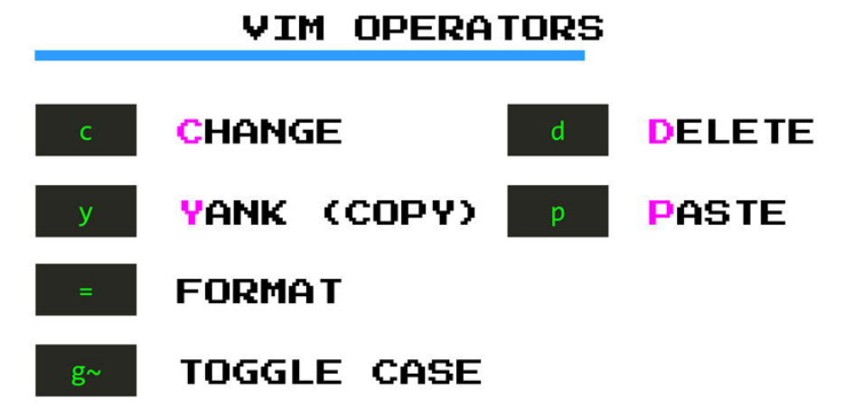

1. 移动  👈h j👇 k👆 l👉

2. w： 下个word 、W：下个WORD

   b ：上个word 、B：上个WORD


3. e：word末尾 、ge 前一个word末尾

4. ```
   > - d for delete
   > - f for find
   > - c for change
   > - t for unTil
   ```

5. f{character}、F{character} 查找这行下个、上个{character}出现的位置

   之后再使用`;`跳到下一个character，`,`跳到上一个character

6. ```
   - `}` jumps entire paragraphs downwards
   - `{` similarly but upwards
   - `CTRL-D` lets you move down half a page by scrolling the page
   - `CTRL-U` lets you move up half a page also by scrolling
   ```

7. ```
   - `0`: Moves to the first character of a line
   - `^`: Moves to the first non-blank character of a line
   - `$`: Moves to the end of a line
   - `g_`: Moves to the non-blank character at the end of a line
   ```

8. ```
   相当于搜索：
   To move anywhere within a file when you haver a target in mind, the best option is to search using:
   
   - `/{pattern}` to search forward 向前搜索
   - `?{pattern}` to search backwards 向后搜索
   单击enter之后-----
   - `n` to go to the next match
   - `N` to go to the previous match
   ```

9. ```
   - Type `gg` to go to the top of the file.
   - Use `{line}gg` to go to a specific line.
   - Use `G` to go to the end of the file.
   - Type `%` jump to matching `({[]})`. eg：f[% ：搜索[之后按%匹配它的反括号
   ```

9. ````
   ```
   {count}{command}
   ```
   
   Try them yourself! Type `2w` to move two words ahead:
   ````

10. ````
    ```
       what to do (delete, change...)
          /
         /      how many times
        /         /
       v         v
    {operator}{count}{motion}
                        ^
                       /
                      /
               where to perform
                 the action
    ```
    For example, take `d2w`. It tells Vim to **d**elete **2** **w**ords. Try it!
    ````

    

    **Double an operator to make it operate on a whole line**

11. ```
    u === 回撤
    ctrl + R === 前进 
    > - dd - delete line
    > - D/d$ - delete from cursor until the end of the line
    ```

12. One of the most amazing operators in Vim is or `.`. The dot operator allows you to **repeat your last change**. 

13. ```
    daw删除一个词（加上尾部的空白）。
    ciw改变内部单词
    das删除一个句子（dis删除内部句子）。
    da" 删除双引号中的内容，包括引号本身（di "只删除引号中的内容，保留引号）。
    ci" 改变双引号内的内容
    ca" 改变双引号内的内容（包含双引号）
    dap 删除一个段落
    dab da(或da)删除一个由（）包围的块。
    daB da{或da}删除一个由{包围的区块。
    dat 删除一个HTML标签
    cit 改变一个HTML标签的内容
    ```

14. ```
    x is equivalent to dl and deletes the character under the cursor 当前
    X is equivalent to dh and deletes the character before the cursor 前一个
    s is equivalent to ch, deletes the character under the cursor and puts you into Insert mode
    ~ to switch case for a single character
    ```

15. ```javascript
    
               you are here
                   /
                  /
                 v
           const status = "I'm in awe"
          ^     ^ ^                   ^
          |     | |                   |
          I     i a                   A
    
    ```

    - `o` lets you *o*pen a new line below the current line
    - `O` lets you *o*pen a new line above the current line

16. ```
    CTRL-h lets you delete the last character you typed
    CTRL-w lets you delete the last word you typed
    CTRL-u lets you delete the last line you typed
    ```

18. ```
    The behavior of `p` and `P` ,you'll paste these characters before or after the cursor 
    ,you'll paste lines below or above the current line.
    ```

19. ```
      1.  creating a new file with (:edit / :e),If the filename that you specify belongs to an existing file, then you’ll just open that file.
        
      2.  :write (shorthand :w) to save a file
      
      3. :quit (shorthand :q) to close a file
      
      4. :write! (shorthand :w!) to save a file even if it’s been saved already or if it is readonly
      
      5. :quit! (shorthand :q!) to close a file without saving.
      
    ```

20. 

